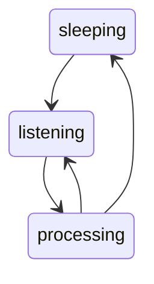

# Introduction
# Quilbert: A Python AI Voice Assistant with State Machine Design
Quilbert is a GPT powered AI voice assistant built using Python.
This project utilizes a state machine design pattern to efficiently handle user input, process it, and provide relevant responses.
With Quilbert, you can easily access information, ask questions, and receive helpful responses using only your voice.

To get started with Quilbert, follow these steps: 

```
$ pip install Quilbert
$ quilbert --debug
```

Once running, Quilbert will begin listening for the wakeword "**porcupine**". When you say "**porcupine**", Quilbert will become active and start listening for your questions or commands.

Please note some common issues you might encounter:
* OpenAI API not set: Configure your OpenAI API key by running `export OPENAI_API_KEY=<your key>`.
* Picovoice access key not set: Set up your Picovoice access key using `export PICOVOICE_ACCESS_KEY=<your key>`.
* Pyaudio import fails because portaudio is not installed: Install portaudio using `brew install portaudio` on mac.

# Architecture Overview

Quilbert's architecture is based on a state machine with three primary states: sleeping, listening, and processing.
The state diagram for Quilbert's architecture can be visualized using Mermaid:


By using this state machine design, Quilbert efficiently handles user interactions, providing a seamless and responsive voice assistant experience.


## Sleeping state
In the sleeping state, Quilbert processes audio chunks, listens for the wakeword, and discards the audio data.
The transitions are as follows:
* Sleeping to listening: Triggered when the wake word is detected.

## Listening state
When in the listening state, Quilbert processes audio chunks, listens for voice activity, and stores the chunks in a buffer. The possible transitions are:
* Listening to sleeping: Triggered when no processing occurs after two minutes of listening.
* Listening to processing: Triggered when voice activity is detected for 0.25 seconds, followed by one second of inactivity.

## Processing state

In the processing state, Quilbert takes the following actions:
1. Converts the buffered audio to text.
2. Fetches a response from the AI model.
3. Plays the response using text-to-speech synthesis.

The transitions from processing state are:
* Processing to sleeping: Triggered when the user says "stop" or another stop phrase.
* Processing to listening: Triggered immediately after processing is complete.
