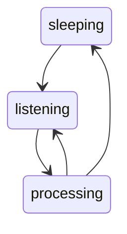

# Introduction
Quilbert is a python AI voice assistant with a statemachine design.

To run Quilbert 

```
$ pip install Quilbert
$ quilbert --debug
```

Quilbert will start listening for the wakeword "**porcupine**."
If you say "**porcupine**" Quilbert will wake up and start listening for questions.

Common issues:
* OpenAI API not set. Try setting your OpenAI API key using `export OPENAI_API_KEY=<your key>`.
* Picovoice access key not set. Try setting your Picovoice access key using `export PICOVOICE_ACCESS_KEY=<your key>`.
* Pyaudio import fails because portaudio is not installed. Try `brew install portaudio` on mac.

# Architecture

Quilbert uses a state machine with three states: sleeping, listening, and processing.

## Sleeping state
Process audio chunks listening for wake word.
Audio chunks are discarded.
* Sleeping to listening: wake word detected.

## Listening state
Process audio chunks listening for voice activity.
Save chunks to a buffer.
* Listening --> sleeping: processing not triggered after 2 min of listening.
* Listening --> processing: voice activity detected for 0.25 s followed by no activity for 1s.

## Processing state
Convert buffer to text.
Get response from AI.
Play response use text to speech synthesis.
* Processing --> sleeping: the user says "stop" or another stop phrase.
* Processing --> listening: immediately when processing is complete.


